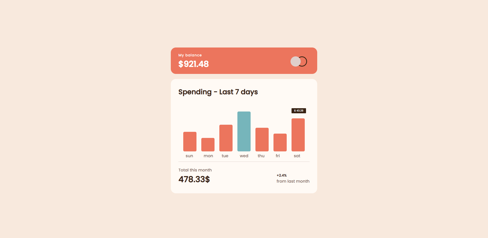
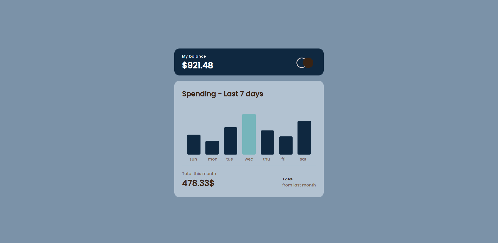
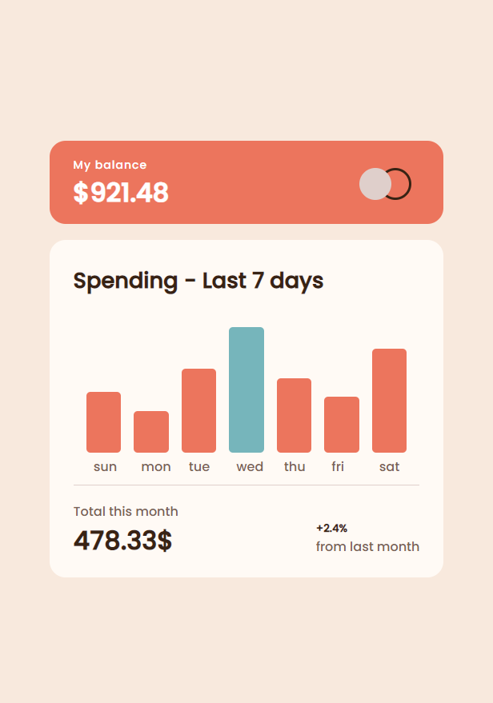

# Expenses CHART COMPONENT - Responsive

## Overview

  <h3>   Demo - URL link -
    <a href="https://expenseschart-by-sumyat.netlify.app/">
     https://expenseschart-by-sumyat.netlify.app/
    </a>
  </h3>

 
 

 
 

 
 

 
 

## Challenge

###  [Expenses chart component challenge on Frontend Mentor](https://www.frontendmentor.io/challenges/expenses-chart-component-e7yJBUdjwt)

 
 

## Built With

- **HTML**
- **CSS**
- **JS**

## Features

- **Responsive and look great on all devices**
- **Expenses Chart component page that is necessary for bussiness**
- **Dark-mode / Light-mode**
- **Hover to see the correct amounts for each day**
